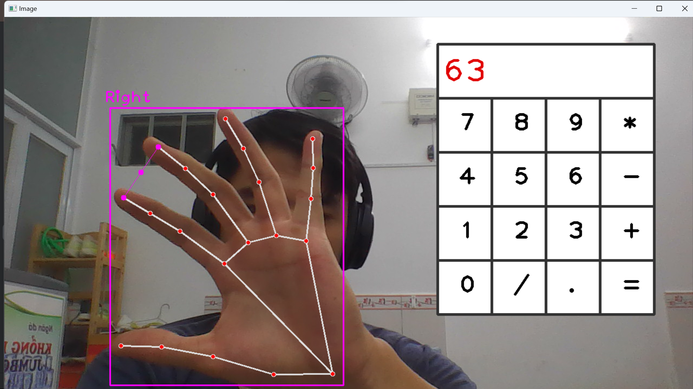

# Virtual_Calculator_With_Python
"Virtual Calculator" is a cutting-edge project developed in Python, harnessing the power of computer vision with OpenCV and the HandTrackingModule from cvzone. This innovative application transforms your webcam into an interactive calculator. By tracking hand gestures, it enables users to perform mathematical operations by clicking on virtual calculator buttons. The project displays the ongoing equation and result in real-time, offering a unique and user-friendly experience. You can conveniently clear the equation or exit the program with simple commands, making it a versatile and engaging utility for mathematics enthusiasts.
# Screenshot

# Explanation Video
https://www.youtube.com/watch?v=RPVIPBBAkx4
